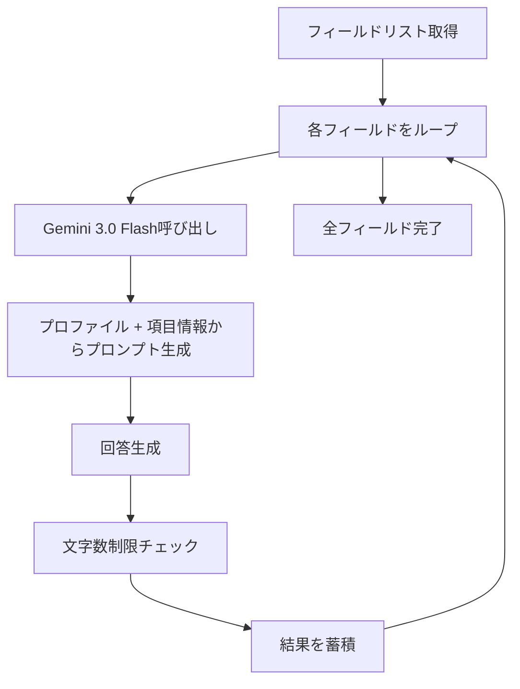

# 項目別フォーマット入力機能 - 仕様書

## 概要

申請書フォーマット（Excel/Word）のフィールドを**項目ごと**に `gemini-3.0-flash` とNPOプロファイルをもとに入力する機能。

従来の「ドラフト全体から一括マッピング」方式から、「各項目にプロファイルを参照して個別に回答を生成」方式に変更。

---

## 主要コンポーネント

### FormatFieldMapper（format_field_mapper.py）

#### 新規メソッド: `fill_fields_individually()`

| パラメータ | 型 | 説明 |
|:----------|:---|:-----|
| `fields` | `List[FieldInfo]` | VLMで検出されたフィールド情報 |
| `profile` | `str` | NPOのSoul Profile |
| `grant_name` | `str` | 助成金名 |
| `grant_info` | `str` | 助成金の詳細情報（募集要項など） |
| `progress_callback` | `Callable` | 進捗通知用コールバック |

**処理フロー:**



---

### DrafterAgent（drafter.py）

`create_draft()` の Step 4 を変更:

- **変更前**: `map_draft_to_fields()` でドラフトからフィールドに一括マッピング
- **変更後**: `fill_fields_individually()` でプロファイルをもとに項目別に回答生成

---

## 使用モデル

| 処理 | モデル |
|:----|:------|
| フィールド検出（VLM） | `gemini-3.0-pro` |
| 項目別回答生成 | `gemini-3.0-flash` |

`gemini-3.0-flash` を項目別処理に使用する理由:
- 高速なレスポンス（項目数が多い場合に有利）
- 低コスト
- 短いプロンプトへの最適化

---

## エラーハンドリング

| ケース | 対応 |
|:-------|:-----|
| 項目の回答生成に失敗 | その項目は空で続行 |
| 文字数オーバー | 末尾をトリム + "..." |
| 全項目失敗 | ドラフトのみ返却 |

---

## 既存機能との互換性

- `map_draft_to_fields()` は引き続き利用可能（後方互換）
- デフォルトでは `fill_fields_individually()` を使用

---

## ログ出力

```
[FORMAT_MAPPER] Processing field 1/5: 団体名
[FORMAT_MAPPER] Successfully filled field: 団体名 (45 chars)
[FORMAT_MAPPER] Processing field 2/5: 事業概要
[FORMAT_MAPPER] Trimmed field para_2 to 400 chars
[FORMAT_MAPPER] Completed filling 5 fields individually
```
