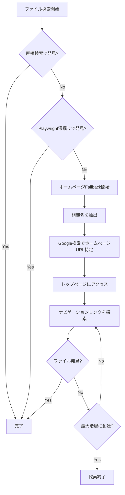
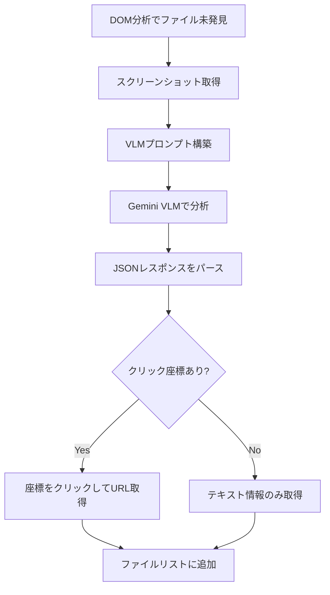

# ファイル探索機能強化 仕様書

## 概要

助成金申請書ファイルが見つからないケースを減らすために、以下の2つの機能を追加した。

1. **ホームページナビゲーションFallback**: 直接のファイル探索に失敗した場合、組織のホームページからナビゲーションを辿ってファイルを探索
2. **VLM視覚分析Fallback**: DOM分析でファイルが見つからない場合、ページのスクリーンショットをVLMで分析してダウンロードリンクを検出

---

## 1. ホームページナビゲーションFallback

### 処理フロー



### 追加されたメソッド

#### GrantPageScraper

| メソッド | 説明 |
|---------|------|
| `fallback_from_homepage(grant_name, max_depth)` | メインエントリーポイント。組織名抽出→ホームページ特定→ナビゲーション探索 |
| `_find_homepage_url(organization_name)` | Google Search GroundingでホームページURLを検索 |
| `_navigate_to_grant_page(homepage_url, grant_name, explorer, max_depth)` | トップから最大3階層まで探索 |
| `_find_navigation_links(links, grant_name)` | 優先キーワードでナビゲーションリンクをスコアリング |
| `_score_grant_page(title, grant_name)` | ページが助成金ページかスコアリング |

#### DrafterAgent

| メソッド | 説明 |
|---------|------|
| `_run_homepage_fallback(grant_name, user_id)` | 同期ラッパー |
| `_async_homepage_fallback(grant_name, user_id)` | 非同期ホームページFallback実行 |

### ナビゲーション優先キーワード

```python
HOMEPAGE_NAV_KEYWORDS = [
    '助成', '補助金', '事業案内', '事業紹介', '支援事業',
    '活動内容', '活動紹介', '事業内容', '実施事業',
    '募集', '公募', '申請', '応募', '募集中', '受付中',
    'お知らせ', 'ニュース', '新着情報', 'トピックス',
    '活動案内', 'program', 'grant', 'support', 'funding'
]
```

---

## 2. VLM視覚分析Fallback

### 処理フロー



### 追加されたメソッド

#### VisualAnalyzer

| メソッド | 説明 |
|---------|------|
| `find_file_links_visually(page, grant_name)` | スクリーンショットからファイルリンクを視覚的に検出 |
| `_build_file_link_detection_prompt(grant_name, viewport_size)` | ファイルリンク検出用プロンプト構築 |
| `_parse_file_links_response(response_text, viewport_size)` | VLMレスポンスのJSONパース |
| `_fallback_parse_file_links(response_text)` | JSONパース失敗時のフォールバックパーサー |

#### GrantPageScraper

| メソッド | 説明 |
|---------|------|
| `_click_and_get_url(page, coordinates, explorer)` | 指定座標をクリックしてURLを取得 |

### VLMプロンプト

VLMには以下の情報をJSON形式で返すよう指示：

```json
{
  "found_count": 2,
  "file_links": [
    {
      "text": "申請書様式（Word）",
      "file_type": "word",
      "x": 500,
      "y": 300,
      "confidence": "high",
      "position": "ページ中央",
      "reason": "Wordアイコンと「申請書様式」テキストが確認できる"
    }
  ]
}
```

### 検出対象

- PDF/Word/Excelのアイコン付きリンク
- 「ダウンロード」「様式」「申請書」「フォーマット」などのボタン/リンク
- ファイル一覧テーブル内のリンク
- アコーディオンやタブ内のリンク

---

## 呼び出しフロー

```
DrafterAgent.create_draft()
    └─ DrafterAgent._research_grant_format()
        ├─ 1. Google Search Grounding でファイル探索
        ├─ 2. Playwright深掘り検索
        └─ 3. ホームページFallback (_run_homepage_fallback)
                └─ GrantPageScraper.fallback_from_homepage()

GrantPageScraper.find_grant_info()
    ├─ 1. DOM分析でファイル検出
    ├─ 2. テキスト分析でURL抽出
    ├─ 3. マルチページ探索
    └─ 4. Visual分析Fallback (find_file_links_visually)
            └─ _click_and_get_url() でURLを取得
```

---

## 設定・環境変数

ハードコーディングなし。すべての設定は `config/prompts.yaml` から読み込み。

---

## 今後の改善案

1. **キャッシュ機構**: 過去に成功したURL探索パターンを記録
2. **探索深度の動的調整**: サイト構造に応じて探索深度を調整
3. **VLM座標精度向上**: 段階的スクリーンショット（全体→部分）で精度向上
