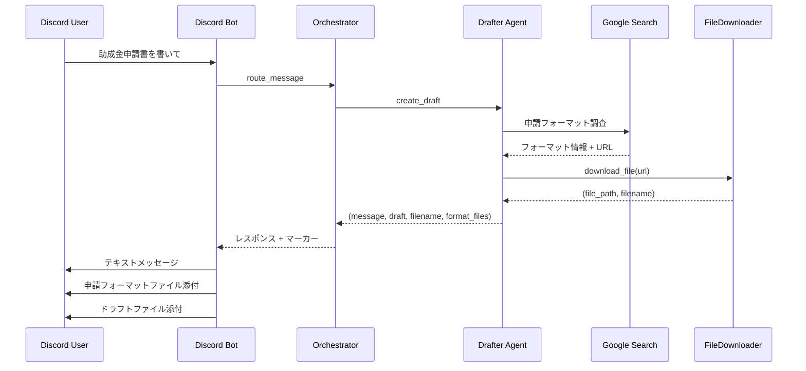

# 助成金申請フォーマットファイル取得機能 仕様書

## 1. 概要

本機能は、助成金申請書のドラフト作成時に、助成金サイトから実際の申請フォーマットファイル（PDF、Word、Excelなど）を自動的に取得し、Discord Botの返信に添付する機能です。

## 2. 主要コンポーネント

### 2.1 FileDownloader ツール

**ファイルパス**: `src/tools/file_downloader.py`

**主要な機能**:
- **URL検証**: HTTP HEADリクエストでURLの有効性を事前確認
  - URLフォーマットチェック
  - ステータスコード確認（404, 403などを検出）
  - Content-Typeチェック
  - ファイルサイズチェック
- URLからファイルをダウンロード
- ファイルタイプの検証（PDF、Word、Excel、ZIPなど）
- ファイルサイズのチェック（Discord制限: 25MB以下）
- 一時保存先の管理

**対応フォーマット**:
- `.pdf` - PDF
- `.doc`, `.docx` - Microsoft Word
- `.xls`, `.xlsx` - Microsoft Excel  
- `.zip` - 圧縮ファイル
- `.txt` - テキストファイル

**制約条件**:
- 最大ファイルサイズ: 25MB（Discord制限）
- タイムアウト: 30秒
- ダウンロード制限: 1回のリクエストにつき最大3ファイル

### 2.2 DrafterAgent の拡張

**ファイルパス**: `src/agents/drafter.py`

**変更内容**:

#### `__init__` メソッド
```python
self.file_downloader = FileDownloader()
```
- FileDownloaderインスタンスを初期化

#### `_research_grant_format` メソッド
- **引数の追加**: `user_id` - ファイル整理用
- **戻り値の変更**: `Tuple[str, List[Tuple[str, str]]]`
  - `format_info`: 申請フォーマット情報（テキスト）
  - `downloaded_files`: ダウンロードしたファイルのリスト `[(file_path, filename), ...]`

**処理フロー**:
1. Google Search Groundingで申請フォーマット情報を検索
2. 検索結果からファイルURLを抽出（正規表現）
3. 最大3つのURLについてファイルをダウンロード
4. ダウンロード成功したファイルのパスとファイル名を返す

#### `create_draft` メソッド
- **戻り値の変更**: `tuple[str, str, str, List[Tuple[str, str]]]`
  - `message`: メッセージ
  - `draft_content`: ドラフト内容
  - `filename`: ドラフトファイル名
  - `format_files`: フォーマットファイルのリスト

### 2.3 Orchestrator の更新

**ファイルパス**: `src/agents/orchestrator.py`

**変更箇所**: 2箇所

1. **DRAFT intent処理** (行223-242)
   - `create_draft`の4つの戻り値を受け取る
   - フォーマットファイルがある場合、`[FORMAT_FILE_NEEDED:user_id:file_path]`マーカーを追加

2. **Strong Match自動ドラフト生成** (行369-383)
   - `create_draft`の4つの戻り値を受け取る
   - フォーマットファイルがある場合、マーカーを結果に追加

### 2.4 Discord Bot の更新

**ファイルパス**: `main.py`

**追加機能**: `[FORMAT_FILE_NEEDED:]` マーカーの処理 (行228-268)

**処理フロー**:
1. レスポンスから`[FORMAT_FILE_NEEDED:user_id:file_path]`マーカーを抽出
2. マーカーをレスポンステキストから削除
3. 各ファイルについて:
   - ファイルの存在確認
   - ファイルサイズチェック（25MB制限）
   - Discord添付ファイルとして送信
4. エラーハンドリング

## 3. 処理フロー



## 4. エラーハンドリング

### 4.1 FileDownloader レベル

| エラー | 処理 |
|--------|------|
| URLフォーマットが無効 | 検証で除外、ログ記録 |
| URLが見つからない (404) | 検証で除外、ログ記録、ユーザーに通知 |
| アクセス拒否 (403) | 検証で除外、ログ記録、ユーザーに通知 |
| タイムアウト | `None`を返す、ログ記録 |
| ファイルサイズ超過 | 検証またはダウンロード中止、`None`を返す |
| サポート外のファイル形式 | `None`を返す、ログ記録 |

### 4.2 Discord Bot レベル

| エラー | 処理 |
|--------|------|
| ファイルが存在しない | 警告メッセージを送信 |
| ファイルサイズ超過 | サイズ情報と共に警告メッセージ |
| 送信エラー | エラーメッセージを送信、ログ記録 |

## 5. セキュリティとプライバシー

### 5.1 ハードコーディングの回避
- 認証情報やAPIキーは環境変数で管理
- ファイルパスは動的に生成

### 5.2 ファイル保存先
- **開発環境**: システム一時ディレクトリ `/tmp/shadow_director_downloads/{user_id}/`
- **本番環境**: GCS または同等のストレージを推奨（将来的な拡張）

### 5.3 自動クリーンアップ
- ダウンロードしたファイルは一時的なもの
- **Discord送信後に自動削除**: ユーザーに送信した直後にファイルを削除
- 削除タイミング:
  - ✅ 送信成功時: 即座に削除
  - ✅ ファイルサイズ超過時: 削除
  - ✅ エラー発生時: クリーンアップとして削除
- `cleanup_user_files(user_id)`メソッドでユーザー別の全ファイルを削除可能

## 6. 使用例

### 6.1 ユーザーからのリクエスト

```
@Shadow Director ○○財団の助成金申請書を書いて
```

### 6.2 Bot の応答

```
📎 **申請フォーマットファイル** が見つかりました:
[添付: application_form.pdf]

✅ ドラフト作成完了
📄 ファイルとして送信します...
[添付: 20251230_○○財団助成金.md]
```

## 7. 制約事項

### 7.1 技術的制約
- Google Search Groundingはファイルを直接ダウンロードできないため、URLを特定して別途HTTPリクエスト
- ログインが必要なサイトには対応不可
- JavaScriptで動的に生成されるフォーマットには対応困難

### 7.2 Discord制約
- 添付ファイルサイズ: 最大25MB（無料サーバー: 8MB、Nitroサーバー: 100MB）
- 本実装では安全のため25MBを上限に設定

## 8. 今後の拡張可能性

### 8.1 GCS統合
- ダウンロードしたファイルをGCSに保存
- 永続的なアクセスURLを生成

### 8.2 ファイル形式の変換
- Wordファイ ルをPDFに変換
- ExcelファイルをCSVに変換

### 8.3 OCR処理
- PDFファイルからテキストを抽出
- より詳細なフォーマット分析

## 9. ログとモニタリング

### 9.1 主要なログポイント
- `[VALIDATE]`: URL検証（成功/失敗、エラー理由）
- `[DRAFTER]`: フォーマット調査、URL抽出、ダウンロード成功/失敗
- `[DOWNLOAD]`: ダウンロード開始、ファイルサイズ、完了
-  `[FORMAT_FILE]`: Discord添付処理、エラー

###9.2 メトリクス
- ダウンロード成功率
- 平均ファイルサイズ
- ダウンロード所要時間

## 10. 変更履歴

| 日付 | バージョン | 変更内容 |
|------|-----------|---------|
| 2025-12-30 | 1.0.0 | 初版リリース |
| 2025-12-30 | 1.1.0 | URL検証機能追加、エラーハンドリング改善 |
| 2025-12-31 | 1.2.0 | ファイル送信後の自動削除機能追加 |
