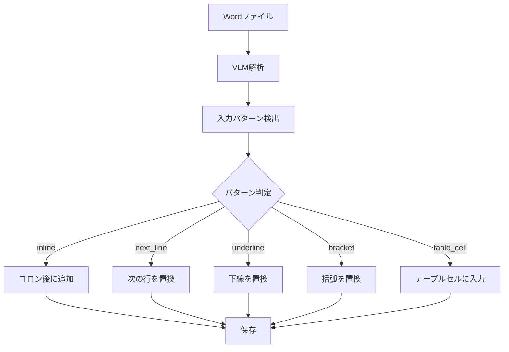

# VLMベースのWord入力パターン検出機能

## 概要

VLMを使用してWordドキュメントの入力フィールドを解析する際、ラベル（例：「団体名：」）と入力パターン（inline、next_lineなど）を検出し、それをもとに正確な位置にデータを入力する機能。

## 入力パターンの種類

| パターン名 | 説明 | 例 |
|-----------|------|-----|
| `inline` | ラベルと同一行、コロン後に入力 | `団体名：[入力値]` |
| `next_line` | ラベルの次の行に入力 | `1. 事業概要（200字以内)\n[入力値]` |
| `underline` | 下線を置換 | `住所：____` → `住所：東京都...` |
| `bracket` | 括弧を置換 | `電話番号（　）` → `電話番号（03-1234-5678）` |
| `table_cell` | テーブルセル内 | テーブル内の空セル |

## 変更ファイル

### format_field_mapper.py

#### `_analyze_word_with_vlm` メソッドの拡張

VLMプロンプトに入力パターン検出を追加:
```python
## 入力パターンの種類
1. **inline** - ラベルと同一行、コロン後に入力する
2. **next_line** - ラベルの次の行に入力する
3. **underline** - 下線プレースホルダー「____」を置換する
4. **bracket** - 括弧プレースホルダー「（　）」を置換する
5. **table_cell** - テーブルセル内に入力する
```

VLMの出力形式:
```json
{
  "field_id": "para_5",
  "field_name": "団体名",
  "input_pattern": "inline",
  "paragraph_idx": 5,
  ...
}
```

#### `map_draft_to_fields` メソッドの拡張

返り値を拡張し、入力パターン情報を含む:
```python
{
  "para_5": {
    "value": "入力値",
    "input_pattern": "inline",
    "field_name": "団体名",
    "location": {...}
  }
}
```

---

### document_filler.py

#### `fill_word` メソッドの修正

新形式と旧形式の両方に対応:
```python
# 新形式と旧形式の両方に対応
if isinstance(field_data, dict):
    value = field_data.get("value", "")
    input_pattern = field_data.get("input_pattern", "inline")
else:
    value = field_data  # 旧形式
    input_pattern = "inline"
```

#### 新規メソッド `_fill_word_paragraph_with_pattern`

入力パターンに基づいて正確な位置にデータを入力:

- **next_line**: 段落全体を入力値で置換
- **underline**: `____` を入力値で置換
- **bracket**: `（　）` を `（入力値）` で置換
- **inline**: コロン後に入力値を追加/置換

フォールバック機能付きで、パターンマッチに失敗した場合は既存の`_fill_word_paragraph`を使用。

## 処理フロー



## 期待効果

- VLMによる正確なフィールド位置と入力パターンの検出
- パターンに応じた適切な入力処理
- フォールバック機能による堅牢性の確保
