# 申請書ドラフト作成処理フロー (Drafter Agent + VLM)

```mermaid
flowchart TD
    Start([ユーザー: ドラフト作成指示]) --> LoadProfile[Soul Profile読み込み]
    LoadProfile --> ExtractInfo[助成金名/URL抽出]
    ExtractInfo --> Sanitize[助成金名サニタイズ<br/>コマンド除去]
    
    Sanitize --> CheckURL{Observer提供<br/>URL有り?}
    CheckURL -->|はい| DirectScrape[提供URLを直接スクレイプ<br/>Playwright]
    CheckURL -->|いいえ| SearchFormat[Google Search<br/>フォーマット検索]
    
    DirectScrape --> FindFiles[フォーマットファイル検出]
    SearchFormat --> ExtractURLs[URLを抽出<br/>grounding_metadata]
    ExtractURLs --> ValidateRelevance[URL関連性チェック<br/>キーワード検証]
    ValidateRelevance --> DeepSearch[Playwright深掘り検索<br/>最大2階層]
    
    DeepSearch --> FindFiles
    FindFiles --> DownloadFiles[ファイルダウンロード<br/>最大5件]
    
    DownloadFiles --> FileClassify[Step 1.5: ファイル分類<br/>VLM Early Filtering]
    
    subgraph Classify["🔍 ファイル分類 (File Classifier)"]
        direction TB
        C1[VLM画像解析<br/>Gemini 3.0 Flash] --> C2{分類結果}
        C2 -->|申請フォーマット| Keep[採用]
        C2 -->|募集要項| Keep
        C2 -->|記入例| Keep
        C2 -->|別の助成金| Exclude[除外]
        C2 -->|無関係| Exclude
    end
    
    FileClassify --> Classify
    Classify --> CheckFormat{フォーマット<br/>ファイル有り?}
    
    CheckFormat -->|はい| AnalyzeFormat[フォーマット解析<br/>Gemini 3.0 Pro]
    CheckFormat -->|いいえ| GenericDraft[汎用ドラフト生成]
    
    AnalyzeFormat --> ExtractContent[PDF/Word/Excel<br/>テキスト抽出]
    ExtractContent --> VLMDetect[VLM入力パターン検出]
    
    subgraph VLM["👁️ VLM処理 (Visual Analyzer)"]
        direction TB
        V1[スクリーンショット撮影] --> V2[Gemini Multimodal解析<br/>Thinking Mode]
        V2 --> V3[入力パターン検出]
        V3 --> V4{パターン種類}
        V4 -->|下線型| Pattern1[_____]
        V4 -->|括弧型| Pattern2["（  ）"]
        V4 -->|次行型| Pattern3[空白行]
        V4 -->|表形式| Pattern4[テーブル]
    end
    
    VLMDetect --> VLM
    VLM --> FieldMapping[項目マッピング<br/>Format Field Mapper]
    
    FieldMapping --> ItemByItem[項目ごとに生成<br/>Gemini 3.0 Flash]
    
    subgraph Generate["✍️ 項目別生成"]
        direction TB
        G1[項目1: 団体概要] --> G2[項目2: 事業計画]
        G2 --> G3[項目3: 予算計画]
        G3 --> G4[...]
        G4 --> G5[プロファイルと整合性確認]
    end
    
    ItemByItem --> Generate
    Generate --> AutoFill[Document Filler<br/>Word/Excel自動入力]
    
    AutoFill --> SaveDraft[ドラフト保存<br/>GCS/Google Docs]
    GenericDraft --> SaveDraft
    
    SaveDraft --> CreateSlide[スライド画像生成<br/>Imagen 3 / Matplotlib]
    CreateSlide --> SendFiles[Discord送信<br/>ファイル+画像]
    
    SendFiles --> End([完了])
    
    Exclude --> CheckFormat
    
    style VLM fill:#e1f5ff
    style Classify fill:#fff3cd
    style Generate fill:#d4edda
```

## 処理の特徴

### Step 1.5: Early File Filtering
- **VLM早期分類**: ファイルごとに関連性を判定
- **無関係ファイル除外**: 別の助成金・無関係ファイルをスキップ
- **処理効率化**: 不要な解析を回避（コスト削減）

### VLM活用ポイント
1. **視覚的パターン検出**
   - スクリーンショットから入力欄を識別
   - DOM解析では困難な複雑レイアウトに対応

2. **入力パターン種別**
   - 下線型: `活動内容： _____`
   - 括弧型: `団体名（    ）`
   - 次行型: 「以下に記入」の後の空白行
   - 表形式: Excel/Wordテーブル

3. **項目別生成**
   - 各項目をGemini 3.0 Flashで個別に生成
   - プロファイル情報から最適な回答を作成
   - 文字数制限・形式を自動遵守

### 成果物
- **Word/Excel**: 自動入力済みドラフト
- **Google Docs**: クラウド保存（オプション）
- **スライド画像**: 視覚的サマリー（Imagen 3生成）
