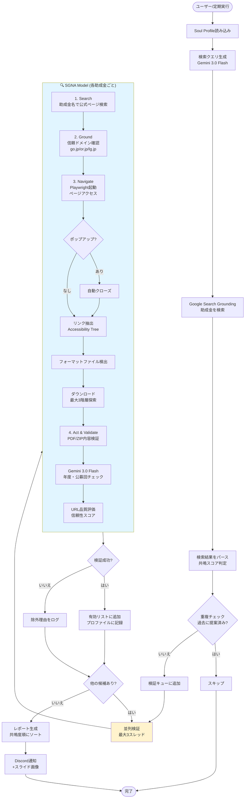

# 助成金検索処理フロー (Observer Agent + SGNA Model)

## 処理の特徴

### 並列処理
- **ThreadPoolExecutor** で最大3スレッド並列実行
- タイムアウト: 30分（1800秒）
- 未完了タスクは自動キャンセル

### SGNA Model の段階
1. **Search**: Gemini + Google Search で公式ページ検索
2. **Ground**: 信頼ドメイン（go.jp等）の確認
3. **Navigate**: Playwrightでページ探索・ファイル検出
4. **Act**: ファイル内容を検証（年度・公募回）

### エラーハンドリング
- ポップアップ自動クローズ（10種類のキーワード対応）
- リンク切れ時の代替URL探索（最大3回）
- デバッグ用スクリーンショット自動保存
