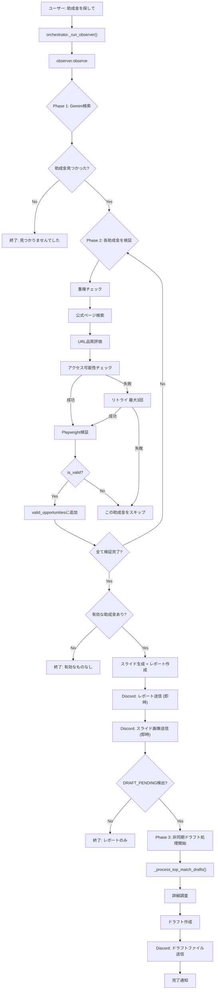

# 助成金検索処理フロー完全ガイド

## 概要

「助成金を探して」コマンドが実行されると、以下の3つの主要フェーズで処理が行われます:

1. **Phase 1: 助成金検索** - Gemini APIで候補を検索
2. **Phase 2: 検証・フィルタリング** - 各候補の公式ページを検証
3. **Phase 3: 自動ドラフト作成** - Top Match（共鳴度90以上）の最高得点助成金のみ自動処理

---

## 処理フロー詳細

### 🚀 エントリーポイント

**ファイル**: [`orchestrator.py:293-310`](file:///c:/Users/keisu/workspace/shadow-director/src/agents/orchestrator.py#L293-L310)

```python
if intent == "OBSERVE":
    # Manual Observer trigger - returns (report, strong_matches)
    report, strong_matches = self._run_observer(user_id)
    
    if strong_matches:
        # Add marker for caller to trigger draft processing AFTER sending report
        matches_json = json.dumps([...])  # Top match data
        report += f"\n[DRAFT_PENDING:{user_id}:{matches_json}]"
    
    return report
```

**トリガー**: ユーザーが「助成金を探して」とメンションを送信

> [!NOTE]
> `_run_observer()` はタプル `(report, strong_matches)` を返します。
> レポート送信後に `DRAFT_PENDING` マーカーを検知してドラフト処理を非同期で開始します。

---

## Phase 1: 助成金検索

### Step 1.1: 初期化

**ファイル**: [`observer.py:63-69`](file:///c:/Users/keisu/workspace/shadow-director/src/agents/observer.py#L63-L69)

**処理内容**:
- ProfileManagerの初期化
- Soul Profileの読み込み
- 現在日付の取得（JST）

**Discord通知**:
```
⚙️ 助成金情報の収集を開始します...
```

### Step 1.2: Gemini検索実行

**ファイル**: [`observer.py:76-79`](file:///c:/Users/keisu/workspace/shadow-director/src/agents/observer.py#L76-L79)

**処理内容**:
1. [`grant_finder.py:114-186`](file:///c:/Users/keisu/workspace/shadow-director/src/logic/grant_finder.py#L114-L186) の `search_grants()` を呼び出し
2. Soul Profileから最適な検索クエリを3つ生成
3. Gemini 2.0 Flash (Thinking Mode) + Google Search Tool で助成金を検索
4. レスポンスをパース → 助成金リスト作成

**Discord通知**:
```
🔍 共鳴する助成金を検索中...
```

**取得されるデータ** (各助成金):
```python
{
    "title": "○○財団 △△助成プログラム",
    "url": "検索結果のURL",
    "amount": "最大500万円",
    "resonance_score": 85,
    "reason": "環境保全活動に特化している点が..."
}
```

### Step 1.3: 検索結果の確認

**ファイル**: [`observer.py:81-83`](file:///c:/Users/keisu/workspace/shadow-director/src/agents/observer.py#L81-L83)

**条件**: `opportunities` が空の場合

**Discord通知**:
```
✅ 新しい助成金は見つかりませんでした。
```

**処理終了**: ここで処理が完了し、ユーザーに結果が返される

---

## Phase 2: 検証・フィルタリング

### Step 2.1: 検証開始通知

**ファイル**: [`observer.py:85`](file:///c:/Users/keisu/workspace/shadow-director/src/agents/observer.py#L85)

**Discord通知**:
```
🔬 {N}件の候補が見つかりました。詳細を調査します...
```

### Step 2.2: 各助成金の検証ループ

**ファイル**: [`observer.py:88-110`](file:///c:/Users/keisu/workspace/shadow-director/src/agents/observer.py#L88-L110)

**処理内容**: 各助成金に対して以下を実行

#### 2.2.1 重複チェック

**処理**: 
```python
if self.profile_manager.is_grant_shown(opp):
    logging.info(f"Skipping already shown grant: {title}")
    continue
```

**結果**: 既出の助成金はスキップ（通知なし）

#### 2.2.2 公式ページ検証

**Discord通知**:
```
🔍 検証中: {助成金名}...
📋 公式ページの確認と信頼性評価
```

**処理**: [`grant_finder.py:188-404`](file:///c:/Users/keisu/workspace/shadow-director/src/logic/grant_finder.py#L188-L404) の `find_official_page()` を実行

##### 2.2.2a: Gemini検索で公式ページを取得

**処理内容**:
1. 組織名を抽出（例: 「公益財団法人トヨタ財団」 → 「トヨタ財団」）
2. 検索クエリ生成: `"{組織名} 助成金 募集 2026" (site:go.jp OR site:or.jp OR ...)`
3. Gemini 2.0 Flash (Thinking Mode) で検索
4. 公式URL、ドメイン、締切情報などを抽出

##### 2.2.2b: URL品質評価

**ファイル**: [`grant_validator.py:170-259`](file:///c:/Users/keisu/workspace/shadow-director/src/logic/grant_validator.py#L170-L259)

**評価項目**:
- ドメインの信頼性 (.go.jp: +30点, .or.jp: +30点, など)
- 組織名がドメインに含まれるか (+25点)
- まとめサイトではないか (-20点)

**Discord通知** (品質スコアに応じて):
```
✅ 信頼性評価: 85点 (公式財団ドメイン(.or.jp), ドメインに組織名'○○財団'を含む)
⚠️ 信頼性評価: 55点 (標準ドメイン)
❌ 信頼性評価: 30点（低） (まとめサイトの可能性(navi))
```

##### 2.2.2c: URLアクセス可能性チェック

**ファイル**: [`grant_validator.py:39-97`](file:///c:/Users/keisu/workspace/shadow-director/src/logic/grant_validator.py#L39-L97)

**処理内容**:
- HTTP GETリクエストを送信
- ステータスコードを確認
- エラーページでないかチェック

**Discord通知** (結果に応じて):
```
✅ 公式ページにアクセス可能 (URL: https://...)
❌ 公式ページにアクセス不可 (タイムアウト)
```

##### 2.2.2d: Playwright詳細検証 (アクセス可能な場合のみ)

**ファイル**: [`grant_finder.py:366-394`](file:///c:/Users/keisu/workspace/shadow-director/src/logic/grant_finder.py#L366-L394)

**Discord通知**:
```
🔍 Playwrightで詳細検証中...
📋 ページ内容を解析しています
```

**処理内容**:
1. Playwrightでページにアクセス
2. フォーマットファイル（PDF, Word, Excel）を検出
3. 締切情報を抽出

**Discord通知** (結果に応じて):
```
📎 フォーマットファイル 3件 発見
📋 申請書様式を検出しました

📅 締切日: 2026年3月31日
📋 ページから締切日を抽出しました

ℹ️ Playwright検証完了
📋 追加情報は見つかりませんでした
```

##### 2.2.2e: リトライロジック (アクセス失敗時)

**ファイル**: [`grant_finder.py:442-561`](file:///c:/Users/keisu/workspace/shadow-director/src/logic/grant_finder.py#L442-L561)

**Discord通知**:
```
⚠️ URL検証失敗: {助成金名の先頭20文字}...
📋 代替URLを検索中... (タイムアウト)
```

**処理内容**:
1. 最大3回のリトライ（異なる検索クエリで）
2. 各リトライごとに通知:
   ```
   🔍 代替検索 (1/3)
   📋 検索: トヨタ財団 助成金 募集 2026...
   ```
3. リトライ成功時:
   ```
   ✅ 代替URL発見 (試行1)
   📋 https://...
   ```

4. 全リトライ失敗 → Playwright探索:
   ```
   🔍 Playwright深掘り検索中...
   📋 組織サイトを探索: トヨタ財団
   ```

5. それでも失敗:
   ```
   ❌ 代替URLが見つかりませんでした
   📋 3回の検索とPlaywright探索で発見できず
   ```

#### 2.2.3 検証結果の判定

**ファイル**: [`observer.py:104-110`](file:///c:/Users/keisu/workspace/shadow-director/src/agents/observer.py#L104-L110)

**条件**: `is_valid = True` の場合
- `valid_opportunities` に追加
- `shown_grants` 履歴に保存

**条件**: `is_valid = False` の場合
- スキップ（ログ出力のみ）

### Step 2.3: 検証完了

**ファイル**: [`observer.py:112-115`](file:///c:/Users/keisu/workspace/shadow-director/src/agents/observer.py#L112-L115)

**条件**: `valid_opportunities` が空の場合

**Discord通知**:
```
✅ 有効な助成金は見つかりませんでした。
```

**返却メッセージ**:
```
候補は見つかりましたが、現在募集中または信頼できる公式サイトが確認できるものはありませでした。
```

### Step 2.4: レポート作成

**ファイル**: [`observer.py:117-121`](file:///c:/Users/keisu/workspace/shadow-director/src/agents/observer.py#L117-L121)

**Discord通知**:
```
⚙️ レポートを作成中...
```

**処理内容**:
- Markdownレポートを生成
- 各助成金の詳細情報をフォーマット

**Discord通知** (完了時):
```
✅ 調査完了！
📋 {N}件の助成金を提案します。
```

---

## Phase 3: 自動ドラフト作成（Top Match検出）

> [!IMPORTANT]
> Phase 3は **非同期処理** です。レポートとスライドが送信された後に開始されます。

### Step 3.0: レポート・スライド送信（先行処理）

**処理内容**:
1. `_run_observer()` が `(report, strong_matches)` を返す
2. レポートに `[DRAFT_PENDING:user_id:matches_json]` マーカーを追加
3. Discord にレポートとスライダを **即時送信**
4. マーカーを検知して非同期でドラフト処理を開始

### Step 3.1: フィルタリング

**ファイル**: [`orchestrator.py:413-425`](file:///c:/Users/keisu/workspace/shadow-director/src/agents/orchestrator.py#L413-L425)

**処理内容**:
1. 既出助成金を除外
2. 共鳴度90以上の助成金を抽出 → `top_matches`
3. 最も共鳴度が高い1件のみ選択 → `strong_matches`

**Discord通知** (Top Matchあり - レポート送信後に表示):
```
---

【🎯 Top Match検出！自動ドラフト生成開始】

共鳴度90以上の案件から、最も共鳴度が高い1件を自動処理します。
助成金の詳細を調査し、ドラフトを作成します...
```

**Discord通知** (Top Matchなし):
```
💡 今回は共鳴度90以上の Top Match は見つかりませんでした。
（共鳴度90未満の候補は{N}件ありました）
```

### Step 3.2: 助成金処理ループ（1件のみ）

**ファイル**: [`orchestrator.py:482-597`](file:///c:/Users/keisu/workspace/shadow-director/src/agents/orchestrator.py#L482-L597) (`_process_top_match_drafts`メソッド)

> [!NOTE]
> スライド生成は Phase 2 完了時（レポート作成前）に全助成金分実行されます。
> Phase 3 では詳細調査とドラフト作成のみを行います。

#### 3.2.1 処理開始通知

**Discord通知**:
```
---

## 🔍 助成金 1/1: {助成金名}
**(共鳴度: 95)**
```

#### 3.2.2 詳細調査

**Discord通知**:
```
**Step 2: 助成金詳細を調査中...**
```

**処理内容**:
- [`drafter.py`](file:///c:/Users/keisu/workspace/shadow-director/src/agents/drafter.py)の `_research_grant_format()` を実行
- 申請フォーマットファイルを検索
- 助成金の詳細情報を取得

**Discord通知** (成功時):
```
📋 詳細取得完了

```
{詳細情報の要約}
```

📎 申請フォーマットファイル:
[FORMAT_FILE_NEEDED:{user_id}:{file_path}]
```

**Discord通知** (フォーマットなし):
```
ℹ️ 詳細情報は基本情報のみ
```

#### 3.2.3 ドラフト作成

**Discord通知**:
```
**Step 3: ドラフト作成中...**
```

**処理内容**:
- Gemini 2.0 Flashで申請書ドラフトを生成
- Google Docsファイルとして保存

**Discord通知** (成功時):
```
ℹ️ 申請フォーマットファイルは見つかりませんでした。
（または）
📎 申請フォーマットファイル:
[FORMAT_FILE_NEEDED:{user_id}:{file_path}]

✅ ドラフト作成完了
[ATTACHMENT_NEEDED:{user_id}:{filename}]
```

**Discord通知** (失敗時):
```
⚠️ ドラフト作成エラー: {エラーメッセージ}
```

#### 3.2.4 処理完了

**Discord通知**:
```
✨ **{助成金名}** の処理完了
```

---

## 最終通知

**ファイル**: [`orchestrator.py:517-523`](file:///c:/Users/keisu/workspace/shadow-director/src/agents/orchestrator.py#L517-L523)

**Discord通知**:
```
📅 **次回の自動観察予定**: 2026年1月12日
（手動で観察を実行したい場合は「助成金を探して」と送信してください）
```

---

## フロー図



---

## タイムライン例

### ケース1: Top Match 1件見つかった場合

```
00:00 ⚙️ 助成金情報の収集を開始します...
00:02 🔍 共鳴する助成金を検索中...
00:15 🔬 3件の候補が見つかりました。詳細を調査します...

00:16 🔍 検証中: ○○財団 環境助成...
00:16 ✅ 信頼性評価: 85点
00:17 ✅ 公式ページにアクセス可能
00:18 🔍 Playwrightで詳細検証中...
00:20 📎 フォーマットファイル 2件 発見

00:21 🔍 検証中: △△基金 社会貢献助成...
00:22 ⚠️ 信頼性評価: 45点（低）
（スキップ）

00:23 🔍 検証中: ××財団 教育支援...
00:24 ❌ 公式ページにアクセス不可
00:25 🔍 代替検索 (1/3)
00:30 ❌ 代替URLが見つかりませんでした

00:31 ⚙️ レポートを作成中...
00:31 📊 スライド生成中...
00:32 ✅ 調査完了！ 1件の助成金を提案します。

[レポート表示 - 即時送信]
[スライド画像表示 - 即時送信]

--- 非同期処理開始 ---

【🎯 Top Match検出！自動ドラフト生成開始】

00:35 ## 🔍 助成金 1/1: ○○財団 環境助成
00:35 **(共鳴度: 95)**

00:36 **Step 1: 助成金詳細を調査中...**
00:45 📋 詳細取得完了
00:45 📎 申請フォーマットファイル
[ファイル送信]

00:46 **Step 2: ドラフト作成中...**
01:30 ✅ ドラフト作成完了
[ドラフトファイル送信]

01:31 ✨ **○○財団 環境助成** の処理完了

📅 **次回の自動観察予定**: 2026年1月12日
```

**合計所要時間**: 約1分30秒
- **レポート表示まで**: 約32秒（ユーザーはすぐに結果を確認可能）
- **ドラフト完成まで**: 追加で約58秒

### ケース2: Top Matchなし（共鳴度70-89のみ）

```
00:00 ⚙️ 助成金情報の収集を開始します...
00:15 🔬 2件の候補が見つかりました。詳細を調査します...
（検証処理）
00:45 ⚙️ レポートを作成中...
00:46 ✅ 調査完了！ 2件の助成金を提案します。

[レポート表示]

💡 今回は共鳴度90以上の Top Match は見つかりませんでした。
（共鳴度90未満の候補は2件ありました）

📅 **次回の自動観察予定**: 2026年1月12日
```

**合計所要時間**: 約45秒

---

## トラブルシューティング

### 「レポートを作成中...」で止まる

**原因**:
- `_format_observation_report()` での例外
- レスポンスが大きすぎてDiscord送信に失敗

**確認方法**:
```bash
gcloud run logs read shadow-director-bot --region us-central1 --limit 100
```

### 検証が長時間かかる

**原因**:
- Playwrightのタイムアウト（30秒）
- リトライ処理（最大3回）
- 遅いサイトへのアクセス

**対策**: タイムアウト設定の見直し（別途実装済み）

### Top Matchが見つからない

**原因**:
- 共鳴度90以上の助成金がない
- 全て既出（shown_grantsに記録済み）

**確認**: 「提案済み助成金一覧」コマンドで履歴確認
