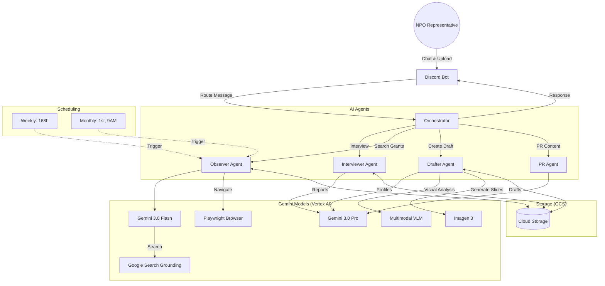

# 🤝 NPO-SoulSync Agent: The Autonomous "Shadow Director"

**「熱意はあるが、時間がない」すべてのソーシャルリーダーへ。**

Google Cloud の最先端（Gemini 3.0 & Vertex AI）を駆使し、あなたの「魂（Soul）」を学習・自律行動する、分身パートナー。

[](https://cloud.google.com/vertex-ai)
[](https://deepmind.google/technologies/gemini/)

## 📖 概要 (Overview)

NPO法人の代表者は、想いと行動力を持ちながらも、常に事務作業とリソース不足に忙殺されています。

本プロダクトは、従来の「人間が使うツール」ではありません。Discord上に常駐し、代表者の「判断基準」と「原体験」を深い対話を通じて学習。その後は **"Shadow Director（影の事務局長）"** として、自律的に外部環境を監視し、チャンスを掴み取りに行きます。

本プロジェクトは、**Google Gemini 3.0 Pro** の推論能力と **Vertex AI** のマネージド機能を極限まで引き出した、次世代の自律型エージェント（Agentic AI）実装です。

## 🏆 Zenn Agentic AI Hackathon 第4回

**Theme:** Agentic AI (自律性・推論・ツール利用・マルチエージェント協調)

### 最先端技術スタック:

- **Gemini 3.0 Pro (Preview)**: 圧倒的な推論・コーディング能力で、複雑な文脈理解とドラフト作成を担当
- **Gemini 3.0 Flash (Preview)**: コストと速度のバランスに優れ、常時監視エージェントとして採用
- **Vertex AI**: Google Cloudの最新AIプラットフォーム、本番グレードのスケーラビリティを提供
- **Google Search Grounding**: Dynamic Retrievalによるリアルタイム情報取得
- **Google Cloud Run**: フルマネージドなコンテナ実行環境、自動スケーリング対応

## ✨ 実装済み機能 (Implemented Features)

### 1. 🗣️ The Soul Sync (Interview Agent) - ✅ Implemented

**「設定ファイルは書かない。対話して、魂を同期する。」**

- **Tech:** Gemini 3.0 Pro + GCS Storage
- **Features:**
  - **PDF/URLドキュメント分析**: 定款・団体HPなどを自動読み込み・理解
  - **Active Inquiry**: AIが「書かれていない代表の想い（原体験）」を特定し、核心を突く質問を投げかける
  - **選択的ターンカウント**: 挨拶や補足説明はカウントせず、実質的なインタビュー質問のみを15問でカウント
  - **構造化プロファイル**: 対話結果を構造化し、GCS (Google Cloud Storage) に永続化
  - **会話履歴管理**: ターン数とコンテキストを保持し、自然な対話を実現
  - **申請書特化モード**: 団体詳細（予算・スタッフ等）やプロジェクト構想（5W1H）を深掘りインタビューし、申請書作成に直結する情報を収集

### 2. 🦅 Autonomous Funding Watch (Observer Agent) - ✅ Implemented

**「あなたが寝ている間に、チャンスを見つけ出す。」**

- **Tech:** Gemini 3.0 Flash + Google Search Grounding + Playwright + **SGNAモデル**
- **Features:**
  - **SGNAモデル（Search-Ground-Navigate-Act）**: 助成金検索の精度と信頼性を大幅に向上
    - **Site Restrictions**: 信頼ドメイン（go.jp/or.jp/lg.jp/co.jp/org/com）を優先検索
    - **Landing Page Priority**: PDFへの直リンクより公募ページを優先
    - **Progressive Wait**: networkidle → domcontentloaded → load の段階的待機
    - **Rate Limiting**: 政府系サイトへの1秒遅延でサーバー配慮
  - **Accessibility Tree Parsing**: CSSセレクタに依存しないセマンティックリンク検索
  - **File Validation Loop**: PDF/ZIPのダウンロード後に年度・公募回を自動検証
  - **Error Recovery**: ポップアップ自動クローズ、代替URL自動試行
  - **Playwright Site Explorer**: DOM解析によるサイト深掘り検索、フォーマットファイル自動検出
  - **Resonance Reasoning**: 財団の理念と自団体の「Soul Profile」の共鳴度（マッチ度）を推論
  - **週次スケジュール**: Discord Tasks Loopによる定期実行（168時間/週）

### 3. ✍️ Shadow Drafter (Action Agent) - ✅ Implemented

**「『とりあえず書いておいたよ』と言えるエージェント。」**

- **Tech:** Gemini 3.0 Pro + Google Docs API / GCS
- **Features:**
  - **自動ドラフト生成**: Soul Profileを基に助成金申請書のドラフトを作成
  - **3層保存ストレージ**:
    1. Google Docs API: 認証情報があればGoogle Docとして直接作成
    2. GCS: Production環境で `gs://{bucket}/drafts/{user_id}/` に永続化
    3. ローカル: 開発環境で `drafts/` フォルダにフォールバック
  - **インテリジェントルーティング**: ユーザーの発言から「DRAFT」意図を自動検出
  - **Word/Excel項目別入力**: Gemini 3.0 Flashで各項目をプロファイル情報をもとに個別生成し、高精度な自動入力
  - **Word入力パターン高精度検出**: VLM (Vision-Language Model) により、`line` / `next_line` / `underline` / `bracket` / `table` 等の入力パターンを視覚的に識別し、正確に記入
  - **Strong Match自動生成**: Observer検出時（共鳴度70+）に自動でドラフトを作成

### 4. 🛡️ Production-Ready Infrastructure - ✅ Implemented

- **Cloud Run Deployment**: フルマネージド、自動スケーリング
  - **Single Instance Mode**: Discord Bot用に `max-instances=1` 設定で重複接続を防止
  - **Always-On**: `min-instances=1` でコールドスタート防止
- **GCS Storage**: プロファイルデータの永続化（`gs://zenn-shadow-director-data`）
- **Health Check**: HTTP ヘルスチェックサーバー内蔵
- **Message Deduplication**: メッセージIDベースの重複処理防止機構

## 🏗️ システム構成 (Architecture)

現在の実装は、Google Cloud上で動作するシンプルかつスケーラブルな構成です。



## 🛠️ 技術スタック (Tech Stack)

### LLM & AI
- **Gemini 3.0 Pro (Preview)**: 推論・執筆・戦略立案（インタビュアー、ドラフター）
- **Gemini 3.0 Flash (Preview)**: チャット・検索・一次選別（オブザーバー）
  - **Vision Language Model (VLM)**: Word/Excel申請書フォーマットの視覚的解析
- **Google Search Grounding**: リアルタイム情報検索
- **Playwright**: ヘッドレスブラウザによるDOM解析・サイト探索
  - Chromium自動インストール（`playwright install chromium`）

### Platform & Infrastructure
- **Google Cloud Run**: フルマネージドコンテナ実行環境
  - Region: `us-central1`
  - Instances: `min=1, max=1` (Discord Bot用シングルトン構成)
  - Memory: `2Gi` (Playwrightブラウザ実行用に増量)
- **Google Cloud Storage (GCS)**: プロファイルデータ永続化
  - Bucket: `gs://zenn-shadow-director-data`
  - プロファイル: `profiles/{user_id}/soul_profile.json`
  - ドラフト: `drafts/{user_id}/*.md`
  - 月次レポート: `reports/{user_id}/monthly_*.md`
- **Google Docs API**: ドラフトをGoogle Docとして直接作成（有効時）
- **Vertex AI**: Gemini API アクセス（`google-genai` SDK with Vertex AI backend）

### Development
- **Language**: Python 3.10
- **Framework**: 
  - `discord.py` (Discord Bot)
  - `google-genai` (Gemini SDK)
  - `playwright` (Browser automation)
  - `python-docx` (Word文書処理)
  - `openpyxl` (Excel文書処理)
  - `pillow` (画像処理)
  - `pyyaml` (設定ファイル管理)
- **Containerization**: Docker + Cloud Build

## 📂 ディレクトリ構成 (Directory Structure)

```text
shadow-director/
├── README.md                        # このファイル
├── Dockerfile                       # Cloud Run デプロイ用
├── deploy_cloudrun.sh               # デプロイスクリプト
├── pyproject.toml                   # 依存関係管理
├── main.py                          # Discord Bot エントリーポイント
├── .agent/
│   └── workflows/
│       ├── deploy_on_wsl.md         # WSLデプロイワークフロー
│       ├── setup-google-docs.md     # Google Docs API セットアップ
│       └── version-update.md        # バージョン更新ワークフロー
├── src/
│   ├── agents/
│   │   ├── orchestrator.py          # メインルーティング・調整エージェント
│   │   ├── interviewer.py           # インタビューエージェント (Gemini 3.0 Pro)
│   │   ├── observer.py              # 監視エージェント (Gemini 3.0 Flash)
│   │   ├── drafter.py               # ドラフト生成エージェント (Gemini 3.0 Pro)
│   │   └── pr_agent.py              # 広報エージェント (SNS投稿生成)
│   ├── tools/
│   │   ├── file_processor.py        # PDF/URL処理ユーティリティ
│   │   ├── search_tool.py           # Google Search Grounding設定
│   │   ├── gdocs_tool.py            # Google Docs API ツール
│   │   ├── site_explorer.py         # Playwright基盤クラス
│   │   ├── slide_generator.py       # スライド画像生成（Imagen 3/matplotlib）
│   │   ├── document_filler.py       # Word/Excel自動入力エンジン
│   │   └── file_downloader.py       # HTTPファイルダウンローダー
│   ├── logic/
│   │   ├── grant_finder.py          # 助成金検索ロジック（SGNAモデル）
│   │   ├── grant_validator.py       # URL検証・品質評価
│   │   ├── grant_page_scraper.py    # Playwright助成金ページスクレイパー
│   │   ├── file_validator.py        # PDF/ZIPファイル検証（SGNAモデル）
│   │   ├── file_classifier.py       # アップロードファイル分類ロジック
│   │   ├── visual_analyzer.py       # VLM入力パターン検出（Word/Excel）
│   │   └── format_field_mapper.py   # フォーマット項目マッピング
│   ├── memory/
│   │   ├── profile_manager.py       # プロファイル管理 (GCS/Local)
│   │   └── memory_bank_storage.py   # Vertex AI Memory Bank 統合
│   ├── utils/
│   │   ├── gemini_client.py         # Gemini クライアント管理
│   │   ├── progress_notifier.py     # 進捗通知システム
│   │   └── office_utils.py          # Office文書ユーティリティ
│   └── version.py                   # バージョン情報管理
├── config/
│   └── prompts.yaml                 # エージェントプロンプト定義
├── docs/                            # 設計資料・仕様書（日本語）
├── scripts/
│   └── format_validator.py          # フォーマット検証スクリプト
└── tests/                           # テストコード
```

## 🚀 Getting Started

### Prerequisites
- Python 3.10+
- Google Cloud Project (Vertex AI API enabled)
- Gemini 3.0 Pro/Flash Preview Access
- Discord Bot Token

### Installation

1. **Clone the repository**
```bash
git clone https://github.com/yourusername/shadow-director.git
cd shadow-director
```

2. **Install Dependencies**
```bash
pip install -e .
```

3. **Configure Environment**
```bash
cp .env.example .env
# Edit .env with your credentials:
# - DISCORD_BOT_TOKEN
# - GOOGLE_CLOUD_PROJECT
# - GCS_BUCKET_NAME
```

4. **Local Development**
```bash
python main.py
```

## 🚀 Deployment (Google Cloud Run)

### 1. Prerequisites
- Google Cloud SDK (`gcloud`) installed & authenticated
- Docker installed

### 2. Setup Google Cloud Project
```bash
# Login to Google Cloud
gcloud auth login
gcloud config set project YOUR_PROJECT_ID

# Enable APIs
gcloud services enable run.googleapis.com \
  cloudbuild.googleapis.com \
  aiplatform.googleapis.com \
  storage.googleapis.com \
  docs.googleapis.com \
  drive.googleapis.com
```

**Note:** デプロイスクリプト (`deploy_cloudrun.sh`) を使用すると、これらのAPIは自動的に有効化されます。

### 3. Create GCS Bucket
```bash
gsutil mb -l us-central1 gs://YOUR-BUCKET-NAME
```

### 4. Build & Deploy
```bash
# Build Docker image
gcloud builds submit --tag gcr.io/YOUR_PROJECT_ID/shadow-director-bot

# Deploy to Cloud Run
gcloud run deploy shadow-director-bot \
  --image gcr.io/YOUR_PROJECT_ID/shadow-director-bot \
  --region us-central1 \
  --platform managed \
  --allow-unauthenticated \
  --memory 1Gi \
  --max-instances 1 \
  --min-instances 1 \
  --set-env-vars "APP_ENV=production,GOOGLE_CLOUD_PROJECT=YOUR_PROJECT_ID,GOOGLE_GENAI_USE_VERTEXAI=True,GCS_BUCKET_NAME=YOUR-BUCKET-NAME,DISCORD_BOT_TOKEN=YOUR_TOKEN"
```

**Note:** For production, use [Secret Manager](https://cloud.google.com/secret-manager) for sensitive values like `DISCORD_BOT_TOKEN`.

### 5. Discord Bot Setup
1. Go to [Discord Developer Portal](https://discord.com/developers/applications)
2. Select your application → **OAuth2** → **URL Generator**
3. Select scopes: `bot`
4. Select permissions:
   - `Send Messages`
   - `Read Message History`
   - `Attach Files`
   - `View Channels`
5. Use generated URL to invite bot to your server

## 📝 License

This project is built for Zenn Agentic AI Hackathon 2025.

---

**Built with ❤️ for Zenn Agentic AI Hackathon 2025**