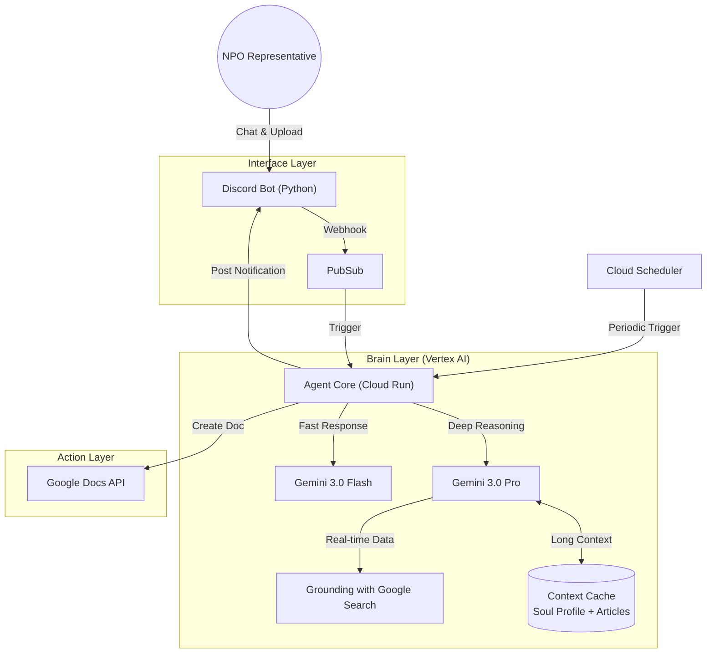

🤝 NPO-SoulSync Agent: The Autonomous "Shadow Director"
"熱意はあるが、時間がない" すべてのソーシャルリーダーへ。 Google Cloud の最先端（Gemini 3.0 & ADK）を駆使し、あなたの「魂（Soul）」を学習・自律行動する、分身パートナー。

(https://img.shields.io/badge/Built_with-Agent_Development_Kit-orange?logo=google-cloud)](https://google.github.io/adk-docs/)

📖 概要 (Overview)
NPO法人の代表者は、想いと行動力を持ちながらも、常に事務作業とリソース不足に忙殺されています。 本プロダクトは、従来の「人間が使うツール」ではありません。Discord上に常駐し、代表者の「判断基準」と「原体験」を深い対話を通じて学習。その後は "Shadow Director（影の事務局長）" として、自律的に外部環境を監視し、チャンスを掴み取りに行きます。

本プロジェクトは、Google Agent Development Kit (ADK) をフレームワークに採用し、Gemini 3.0 Pro の推論能力と Vertex AI Agent Engine のマネージド機能を極限まで引き出した、次世代の自律型エージェント（Agentic AI）実装です。

🏆 Zenn Agentic AI Hackathon 第4回 戦略ターゲット
Theme: Agentic AI (自律性・推論・ツール利用・マルチエージェント協調)

Cutting-Edge Tech Stack:

Gemini 3.0 Pro (Preview): 圧倒的な推論・コーディング能力で、複雑な文脈理解とドラフト作成を担当 。

Gemini 2.5 Flash: コストと速度のバランスに優れ、"Thinking Budget" を制御可能な常時監視エージェントとして採用 。

Google ADK (Agent Development Kit): Googleが開発した最新のエージェント構築フレームワーク。

Vertex AI Agent Engine (GA): 2025年12月に一般提供開始されたばかりの「Sessions」と「Memory Bank」機能をフル活用し、堅牢な状態管理を実現 。

Dynamic Retrieval: Gemini 3.0の判断で「検索が必要な時だけ検索する」コスト最適化された自律検索 。

✨ Agentic Core Features (主な機能)
1. 🗣️ The Soul Sync (Interview Agent)
「設定ファイルは書かない。対話して、魂を同期する。」

Tech: Gemini 3.0 Pro + Vertex AI Memory Bank (GA)

Behavior: アップロードされた定款やHPを読み込み、Gemini 3.0 Proが「書かれていない代表の想い（原体験）」を特定。Active Inquiryにより、「なぜその活動が必要なのか？」「一番悔しかったことは？」など、核心を突く質問を能動的に投げかけます。

Innovation: 対話結果は単純なテキストログではなく、構造化された「信念プロファイル」として Vertex AI Memory Bank に永続化され、全エージェントで共有されます 。

2. 🦅 Autonomous Funding Watch (Observer Agent)
「あなたが寝ている間に、チャンスを見つけ出す。」

Tech: Gemini 2.5 Flash + Dynamic Retrieval Grounding

Behavior:

Smart Observation: Google Search Groundingを活用し、助成金情報や企業のCSR活動を定期監視。

Dynamic Retrieval: 常に検索するのではなく、エージェントが「自身の知識で判断できない」と確信した場合（Confidence Score < Threshold）のみ検索を実行。Gemini 2.5 Flashの高速性を活かしつつ、最新情報を逃しません 。

Resonance Reasoning: 単なるキーワード一致ではなく、財団の理念と自団体の「Soul Profile」の共鳴度（マッチ度）を推論します。

3. ✍️ Shadow Drafter (Action Agent)
「『とりあえず書いておいたよ』と言えるエージェント。」

Tech: Gemini 3.0 Pro + ADK Tool Use

Behavior: マッチ度が高い案件について、Memory Bank内の過去の実績や代表のエピソードを引用し、Gemini 3.0 Proの高い言語能力で「採択されやすい申請書ドラフト」を自動生成。Google Docs APIを通じて即座に共有します。

🏗️ システム構成 (Architecture)
最新の Google Agent Development Kit (ADK) を採用し、スケーラブルかつモジュラーなマルチエージェントシステムを構築しています。
ユーザー（NPO代表）とエージェントが協働する「デジタルオフィス」として Discord を採用。



🛠️ 技術スタック (Tech Stack)
* LLM: Google Gemini 3.0 Pro (推論・執筆・戦略立案), Gemini 3.0 Flash (チャット・一次選別)

* Why 3.0 Pro? : 助成金の「募集要項の裏にある意図」を読み解く文脈理解力と、数千件の情報を裁く処理速度の両立のため。

* Platform: Google Cloud (Vertex AI, Cloud Run, Pub/Sub, Cloud Scheduler)

* Interface: Discord.py

* Framework: LangChain or Firebase Genkit (検討中)

📂 ディレクトリ構成 (Directory Structure)
本リポジトリは、Google ADK (Python) の標準構成に準拠しています。

```text
.
 ├── README.md
 ├── pyproject.toml # 依存関係 (google-adk, etc.)
 ├── main.py # Discord Gateway Entrypoint
 ├── adk_deploy.sh # Agent Engine デプロイ用スクリプト
 ├── src
 │ ├── agents
 │ │ ├── init.py
 │ │ ├── orchestrator.py # ルーティングロジック
 │ │ ├── interviewer.py # Gemini 3.0 Pro 定義
 │ │ ├── observer.py # Gemini 2.5 Flash + Search定義
 │ │ └── drafter.py # ドキュメント生成定義
 │ ├── tools
 │ │ ├── search_tool.py # Dynamic Retrieval Config設定
 │ │ └── gdocs_tool.py # Google Docs API Tool
 │ └── memory
 │ └── profile_manager.py # Memory Bank 操作用
 └── config
 └── prompts.yaml # 各エージェントのシステムプロンプト
```

🗓️ 開発ロードマップ (Roadmap)

### Phase 1: The Soul Sync (Foundation) - ✅ Complete
- [x] **Project Setup**: ADKディレクトリ構成と環境設定
- [x] **Mock Runner**: Discordなしでロジック検証を行うCLIツールの実装
- [x] **Interviewer Agent**:
    - [x] Gemini 2.5 Pro (via Vertex AI) による深層インタビューロジック
    - [x] 会話からの「Insight (原体験・Mission)」抽出と構造化データの保存 (Local JSON)
    - [x] インタビュー制御 (最大質問数制限、理解度表示)
- [x] **Profile Manager**: ローカル環境(JSON)と本番環境(GCS)の抽象化レイヤー

### Phase 2: The Observer (Autonomy) - ✅ Complete
- [x] **Observer Agent (Logic)**:
    - [x] 助成金情報とSoul Profileの「共鳴度(Resonance Score)」判定プロンプト
- [x] **Observer Agent (Tools)**:
    - [x] Google Search Grounding / Dynamic Retrieval の完全統合
    - [x] 検索クエリの自律生成ロジック (`_generate_queries`)
- [x] **Orchestrator**: 
    - [x] Periodic Checks logic Implementation
- [x] **Scheduling**:
    - [x] Discord Tasks Loop による定期実行トリガー (168h/Weekly)

### Phase 3: The Action & Interface (Integration) - ✅ Complete
- [x] **Drafter Agent**:
    - [x] 申請書ドラフト生成ロジック (`src/agents/drafter.py`)
    - [x] Mock Google Docs Output (`src/tools/gdocs_tool.py`)
- [x] **Discord Integration**:
    - [x] Discord Bot UI (PyCord / Discord.py) の実装
    - [x] 非同期通知システム
- [x] **Deployment** (Complete):
    - [x] Dockerfile & Deployment Scripts (`Dockerfile`, `deploy_cloudrun.sh`)
    - [x] Vertex AI Agent Engine Integration
    - [x] Cloud Run Hosting (`https://shadow-director-bot-182793624818.us-central1.run.app`)
### Phase 6: Deployment Preparation - ✅ Complete
- [x] **Containerization**:
    - [x] Dockerfile & .dockerignore
- [x] **Deployment Scripts**:
    - [x] `deploy_cloudrun.sh` (Google Cloud Run)
- [x] **Production Release** (See `docs/NEXT_STEPS.md`):
    - [x] Execute Deployment to Google Cloud
    - [ ] Discord Real-world Testing (In Progress)

🚀 Deployment (Google Cloud Run)

本番環境(Google Cloud Run)へのデプロイ手順です。

### 1. Prerequisites
- Google Cloud SDK (`gcloud`) installed & authenticated.
- Docker installed.

### 2. Setup Google Cloud Project
```bash
# Login to Google Cloud
gcloud auth login
gcloud config set project zenn-shadow-director

# Enable APIs
gcloud services enable run.googleapis.com cloudbuild.googleapis.com aiplatform.googleapis.com
```

### 3. Deploy
付属のスクリプトを使用することで、ビルドからデプロイまでを一括で行えます。

```bash
# Linux / WSL / Git Bash
bash deploy_cloudrun.sh
```

**Note:** `deploy_cloudrun.sh` 内の `REGION` や `PROJECT_ID` は適宜修正してください。
また、本番運用時は `DISCORD_BOT_TOKEN` を [Secret Manager](https://cloud.google.com/secret-manager/docs/creating-and-accessing-secrets) 経由で渡すことを強く推奨します。

### 4. Discord Bot Setup (Invitation)
Botをサーバーに招待するための手順です。

1. [Discord Developer Portal](https://discord.com/developers/applications) にアクセス。
2. アプリケーションを選択し、左メニューの **OAuth2** -> **URL Generator** をクリック。
3. **SCOPES** で `bot` にチェックを入れる。
4. **BOT PERMISSIONS** で以下にチェックを入れる（または `Administrator`）:
    - `Send Messages`
    - `Read Message History`
    - `Attach Files` (ドラフト送付用)
    - `View Channels`
5. 生成された URL をブラウザで開き、自分のサーバーに追加する。

### 5. Verify
デプロイ完了後、Discord Bot がオンラインになり、メンションやDMに応答することを確認してください。

🚀 Getting Started
Prerequisites
Python 3.10+

Google Cloud Project (Vertex AI API enabled)

Gemini 3.0 Pro Preview Access (enabled via Vertex AI)

Discord Bot Token

Installation
Clone the repository

Install ADK & Dependencies:

Configure Environment:

Run Locally (ADK Runner):

Built with ❤️ for Zenn Agentic AI Hackathon 2025